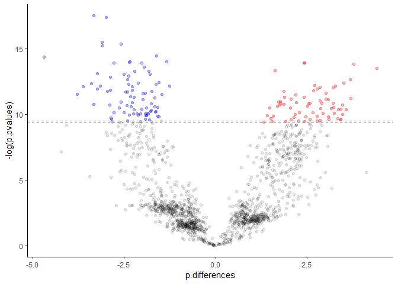
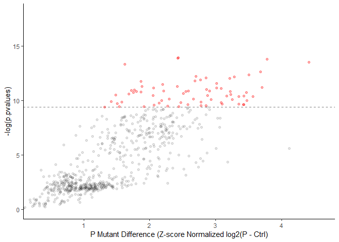
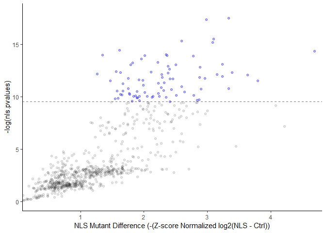

Smith et.al. 2018 PNAS 115 (49) E11465-E11474
================

Data analysis for TurboID samples from Scott Lab. AKAP18 mutants: P, a nuclear retention mutant that stop translocation from nuclear to cytoplasm; and a NLS that stay in the cytoplasm, were fused to TurboID. The fusion proteins were overexpressed in in vitro cultured cells in the present of biotin for proximal labeling of possible interacting proteins. TurboID was also overexpressed as control.

For biological replicates, there are 3 control samples, 4 nls smaples and 4 p samples.

``` r
library(tidyverse)
library(stringr)
library(ggthemes)

# for joy plot
library(ggridges)
# for labeling of geom_point, which repel the label when they are overlapping
library(ggrepel)
# for Venn diagram
library(VennDiagram)
```

Read the data .txt select the columns required for this analysis and filter the contaminations.

The table contains 2494, 138, rows and columns, respectively. Most of the columns are not required for the differential protein quantification, so I will remove them. Then there are three columns containing the contamination information. These columns are combined to filter out contaminations, then the columns can also be removed because they will not be used again.

``` r
clean.PG <- raw.PG %>% 
  dplyr::select(Protein.names, 
                Gene.names, 
                Fasta.headers, 
                Majority.protein.IDs,
                starts_with("LFQ"),
                Only.identified.by.site, 
                Reverse, 
                Potential.contaminant) %>%
  # unite the contamination columns for easier filtering
  unite(con,    
        Only.identified.by.site, Reverse, Potential.contaminant, sep = "") %>%
  filter(con == "") %>% 
  dplyr::select(-con)
```

For the analysis, I will need to log transform the data, check the distribution and normalize. Normalization will be done using Z-scores transformation. I will also check the number of quantified proteins in each sample.

``` r
LFQ <- clean.PG %>% dplyr::select(starts_with("LFQ"))  # extract the numeric columns
# log transform
log.LFQ <- apply(LFQ, 2, log2)
# replace the -Inf 
log.LFQ <- as.data.frame(apply(log.LFQ, 2, function(x) ifelse(is.infinite(x), NA, x)), stringsAsFactors = FALSE)
# rename the columns
n <- str_locate(names(log.LFQ)[1], "LFQ.intensity.")[2]
column.names <- names(log.LFQ)
column.names <- substr(column.names, n + 1, nchar(column.names))
colnames(log.LFQ) <- column.names

# check distribution
log.LFQ.ridge <- log.LFQ %>% gather(key = "Samples", value = "Log2.LFQ")
ggplot(log.LFQ.ridge) +
  geom_density_ridges(mapping = aes(x = Log2.LFQ, y = Samples))
```

    ## Picking joint bandwidth of 0.703

    ## Warning: Removed 19312 rows containing non-finite values
    ## (stat_density_ridges).


``` r
# Normalization, I have also tried to compared the peak shape between z-score and MAD normalization,
# but i don't see any obvious difference between the two method, so just do z-scores 
log.LFQ <- apply(log.LFQ, 2, scale, center = TRUE, scale = TRUE)
log.LFQ <- data.frame(log.LFQ, stringsAsFactors = FALSE)

# check distribution
log.LFQ.ridge <- log.LFQ %>% gather(key = "Samples", value = "Log2.LFQ")
ggplot(log.LFQ.ridge) +
  geom_density_ridges(mapping = aes(x = Log2.LFQ, y = Samples)) + 
  xlab("Normalized LFQ")
```

    ## Picking joint bandwidth of 0.24

    ## Warning: Removed 19312 rows containing non-finite values
    ## (stat_density_ridges).


``` r
# check how well the replicates are
pairs(log.LFQ, pch = ".")
```


``` r
# check the number of quantified proteins for each sample
apply(log.LFQ, 2, function(x) sum(!is.na(x)))
```

    ## ctrl.1 ctrl.3 ctrl.8  nls.1  nls.2  nls.3  nls.8    p.1    p.2    p.3 
    ##    212    520    162    782    503    937    936    702    320   1087 
    ##    p.8 
    ##    718

Based on the scatterplots, reproducibility is not bad. The controls look significantly different, but this is expected. The table result showed that p.2 has much less quantified proteins. So I will exclude it for further analysis.

Then I will count the missing data per gene for each treatment, i.e., control, P- and NLS- mutants. This will impact the filtering and p-value adjustment downstream.

I will also impute the missing value with a random number from a distribution with mean at -2 and 0.1 s.d. This assumes that the missing data is due to the signal being under the machine detection threshold.

``` r
log.LFQ$p.2 <- NULL
```

``` r
sample.names <- c("ctrl", "nls", "p")

count.NAs <- function(x) {
  # separate the samples here 
  sep.sample <- log.LFQ[, grepl(pattern = x, x = names(log.LFQ)), drop = FALSE]
  # get length for calculating %
  len.sample <- length(sep.sample)
  # count NAs and calculate the percentage of missing data
  sep.sample$NAs <- apply(sep.sample, 1, 
                      function(x) sum(is.na(x)))
  sep.sample$percent.NAs <- sep.sample$NAs / len.sample
  # rename the column
  colnames(sep.sample)[as.integer(length(sep.sample))] <- str_c(x, ".percent.NAs")
  # keep the last column only
  sep.sample <- sep.sample[, as.integer(length(sep.sample)), drop = FALSE]
  
  return(sep.sample)
}

NA.counts <- lapply(sample.names, count.NAs)
NA.counts <- Reduce(x = NA.counts, 
                    f = function(x,y) cbind(x,y))
```

``` r
# because it is z-score transformated, so the mean will be 0 and sd will be 1
data.size <- dim(log.LFQ)
# make the random distribution of values for imputation. Downshift 2 and sd = 0.1
set.seed(576)
impute.values <- rnorm(n = data.size[1] * data.size[2],
                       mean = -2, sd = 0.1)
# impute
set.seed(576)
log.LFQ.imputed <- data.frame(apply(log.LFQ, 2, 
                                    function(x) ifelse(is.na(x), sample(impute.values), x)),
                              stringsAsFactors = FALSE)
# rename columns
colnames(log.LFQ.imputed) <- str_c("Imputed.", names(log.LFQ.imputed))
```

Then to identified the specific interacting partner of the P- and NLS- mutants, a t-test will be perform to compare the mutants to the control sample.

``` r
# write an automated function, in case more samples are added in the future

# the sample names
treatment <- c("nls", 
               "\\.p\\.")
ctrl <- "ctrl"

log.LFQ.imputed <- log.LFQ.imputed

auto.ttest <- function(x) {   # input x will be a vector containing the treatment names, so treatment here
  # extracdt the treatment sample according to the sample vector from above
  treatment <- log.LFQ.imputed[, grepl(pattern = x, x = names(log.LFQ.imputed)), drop = FALSE]
  # the rest will be anything, but the sample of interest
  ctrl <- log.LFQ.imputed[, grepl(pattern = ctrl, x = names(log.LFQ.imputed)), drop = FALSE]
  
  # get the length of the sample and ctrl, this will be used for indexing later
  len.t <- length(treatment)  # number of columns in the treatment
  len.c <- length(ctrl) # number of columns in the control
  
  # do the t.test
  df.for.ttest <- cbind(ctrl, treatment)
  len.df <- as.integer(length(df.for.ttest))
  
  df.for.ttest$Test.results <- NA
  df.for.ttest$Sample.mean <- NA
  df.for.ttest$Ctrl.mean <- NA
  df.for.ttest$Difference <- NA
  df.for.ttest$pvalue <- NA
  
  df.for.ttest$Test.results <- 
      apply(df.for.ttest, 
            1, 
            function(x) t.test(x = x[as.integer(len.c+1):as.integer(len.c+len.t)],  # x is treatment
                               y = x[1:as.integer(len.c)], var.equal = TRUE)[c(3,5)])
  
  df.for.ttest$pvalue <- apply(df.for.ttest[,"Test.results", drop = FALSE], 1, 
                               function(x) unlist(x[[1]][1]))
  df.for.ttest$Sample.mean <- apply(df.for.ttest[,"Test.results", drop = FALSE], 1, 
                                    function(x) unlist(x[[1]][[2]][1]))
  df.for.ttest$Ctrl.mean <- apply(df.for.ttest[,"Test.results", drop = FALSE], 1, 
                                    function(x) unlist(x[[1]][[2]][2]))
  df.for.ttest$Difference <- df.for.ttest$Sample.mean - df.for.ttest$Ctrl.mean
  
  results <- df.for.ttest[, c("Sample.mean", "Ctrl.mean", "Difference", "pvalue")]
  colnames(results) <- str_c(names(results), x)
  
  
  return(results)
}

# apply the function
ttest.result.list <- lapply(treatment, auto.ttest)
ttest.results <- Reduce(x = ttest.result.list, f = function(x,y) cbind(x,y))

ttest.results <- ttest.results[, c(2,5,7,8,1,3,4)]
colnames(ttest.results) <- c("Ctrl.means", "p.means", "p.differences", "p.pvalues",
                             "nls.means", "nls.differences", "nls.pvalues")
```

Finally, the proteins with high missing values from the mutants are removed. P-values are adjusted using the FDR method. And the results are visualized using volcano plots and Venn diagram. Which final figure will be used is depending on the collaborator. Table containing the results will also be exported.

``` r
# tidy up the resulting data from the t-test
p.data <- cbind(clean.PG[,c(2,3)], ttest.results[, c(2:4)], NA.counts)
p.data <- p.data[p.data$p.percent.NAs < 0.6, ]
p.data$p.adjust.p <- p.adjust(p.data$p.pvalues)

nls.data <- cbind(clean.PG[,c(2,3)], ttest.results[, c(5:7)], NA.counts)
nls.data <- nls.data[nls.data$nls.percent.NAs < 0.6, ]
nls.data$nls.adjust.p <- p.adjust(nls.data$nls.pvalues)
```

``` r
# find 0.05 fdr for each
p.05 <- p.data[p.data$p.adjust.p > 0.05,]
p.05 <- min(p.05$p.pvalues)

nls.05 <- nls.data[nls.data$nls.adjust.p > 0.05,]
nls.05 <- min(nls.05$nls.pvalues)

both.plot <- ggplot() +
  # p
  geom_point(data = p.data[p.data$p.pvalues > p.05,], 
             mapping = aes(x = p.differences, y = -log(p.pvalues)), alpha = 0.1) +
  geom_hline(yintercept = -log(p.05), alpha = 0.5, lty = 2) +
  # above fdr
  geom_point(data = p.data[p.data$p.pvalues <= p.05,], 
             mapping = aes(x = p.differences, y = -log(p.pvalues)), alpha = 0.3, colour = "Red") +
  
  # nls mutant, below fdr
  geom_point(data = nls.data[nls.data$nls.pvalues > nls.05,],
             mapping = aes(x = -(nls.differences), y = -log(nls.pvalues)), alpha = 0.1) +
  geom_hline(yintercept = -log(nls.05), alpha = 0.5, lty = 2) + 
  # above fdr
  geom_point(data = nls.data[nls.data$nls.pvalues <= nls.05,],
             mapping = aes(x = -(nls.differences), y = -log(nls.pvalues)), alpha = 0.3, colour = "blue") +
  
  #coord_cartesian(xlim = c(0.5, 4.5)) +
  theme_classic()
both.plot
```



``` r
# i want to see whether I can plot both data into 1 plot
p.plot <- ggplot() +
  # p mutant, below fdr
  geom_point(data = p.data[p.data$p.pvalues > p.05,], 
             mapping = aes(x = p.differences, y = -log(p.pvalues)), alpha = 0.1) +
  geom_hline(yintercept = -log(p.05), alpha = 0.5, lty = 2) +
  # above fdr
  geom_point(data = p.data[p.data$p.pvalues <= p.05,], 
             mapping = aes(x = p.differences, y = -log(p.pvalues)), alpha = 0.3, colour = "Red") +
  
  coord_cartesian(xlim = c(0.3, 4.6), ylim = c(0, 18)) +
  xlab("P Mutant Difference (Z-score Normalized log2(P - Ctrl)") +
  theme_classic()
p.plot
```



``` r
nls.plot <- ggplot() +
  # nls mutant, below fdr
  geom_point(data = nls.data[nls.data$nls.pvalues > nls.05,],
             mapping = aes(x = -(nls.differences), y = -log(nls.pvalues)), alpha = 0.1) +
  geom_hline(yintercept = -log(nls.05), alpha = 0.5, lty = 2) + 
  # above fdr
  geom_point(data = nls.data[nls.data$nls.pvalues <= nls.05,],
             mapping = aes(x = -(nls.differences), y = -log(nls.pvalues)), alpha = 0.3, colour = "blue") +
  
  coord_cartesian(xlim = c(-0.3, -4.6), ylim = c(0, 18)) +
  xlab("NLS Mutant Difference (-(Z-score Normalized log2(NLS - Ctrl))") +
  theme_classic()
#nls.plot

nls.plot2 <- ggplot() +
  # nls mutant, below fdr
  geom_point(data = nls.data[nls.data$nls.pvalues > nls.05,],
             mapping = aes(x = nls.differences, y = -log(nls.pvalues)), alpha = 0.1) +
  geom_hline(yintercept = -log(nls.05), alpha = 0.5, lty = 2) + 
  # above fdr
  geom_point(data = nls.data[nls.data$nls.pvalues <= nls.05,],
             mapping = aes(x = nls.differences, y = -log(nls.pvalues)), alpha = 0.3, colour = "blue") +
  
  coord_cartesian(xlim = c(0.3, 4.6), ylim = c(0, 18)) +
  xlab("NLS Mutant Difference (-(Z-score Normalized log2(NLS - Ctrl))") +
  theme_classic()
nls.plot2
```



``` r
library(VennDiagram)

venn <- draw.pairwise.venn(57 + 24, 40 + 24, 24,
                           fill = c("blue", "red"),
                           alpha = c(0.5, 0.5), 
                           category = c("NLS", "P"))
```


``` r
#pdf(file = "fdr_05.pdf")
#grid.draw(venn)
#dev.off()
venn
```

    ## (polygon[GRID.polygon.384], polygon[GRID.polygon.385], polygon[GRID.polygon.386], polygon[GRID.polygon.387], text[GRID.text.388], text[GRID.text.389], text[GRID.text.390], text[GRID.text.391], text[GRID.text.392])

``` r
output <- NULL
output <- cbind(clean.PG[, 1:3], ttest.results[, 1:4])
output <- left_join(output, p.data[, c(2,9)], by = "Fasta.headers")

output <- cbind(output, ttest.results[, 5:7])
output <- left_join(output, nls.data[, c(2,9)], by = "Fasta.headers")

output <- cbind(output, clean.PG[,5:15])
output <- cbind(output, log.LFQ)
output <- cbind(output, log.LFQ.imputed)

output <- data.frame(apply(output, 2, function(x) ifelse(is.na(x), "", x)))

#write.table(output, "AKAP18_p_nls_BioID.txt", 
#            append = FALSE, sep = "\t", row.names = FALSE, quote = FALSE)
head(output)
```

    ##                                     Protein.names           Gene.names
    ## 1                                                              IGKV1-8
    ## 2                     Sentrin-specific protease 3   SENP3-EIF4A1;SENP3
    ## 3 Transmembrane emp24 domain-containing protein 7   TMED7-TICAM2;TMED7
    ## 4                       60S ribosomal protein L17 RPL17-C18orf32;RPL17
    ## 5                    Suppressor of SWI4 1 homolog     PPAN-P2RY11;PPAN
    ## 6                                  Helicase SRCAP                SRCAP
    ##                                                                                                                                                                                            Fasta.headers
    ## 1                              tr|A0A0U1RRF4|A0A0U1RRF4_HUMAN Protein IGKV1-8 OS=Homo sapiens GN=IGKV1-8 PE=4 SV=1;tr|A0A087WWV8|A0A087WWV8_HUMAN Protein IGKV1-12 OS=Homo sapiens GN=IGKV1-12 PE=1 SV=2
    ## 2          tr|A0A087X0R7|A0A087X0R7_HUMAN Protein SENP3-EIF4A1 (Fragment) OS=Homo sapiens GN=SENP3-EIF4A1 PE=4 SV=1;sp|Q9H4L4|SENP3_HUMAN Sentrin-specific protease 3 OS=Homo sapiens GN=SENP3 PE=1 SV=2
    ## 3 tr|A0A0A6YYA0|A0A0A6YYA0_HUMAN Protein TMED7-TICAM2 OS=Homo sapiens GN=TMED7-TICAM2 PE=3 SV=1;sp|Q9Y3B3|TMED7_HUMAN Transmembrane emp24 domain-containing protein 7 OS=Homo sapiens GN=TMED7 PE=1 SV=2
    ## 4                    tr|A0A0A6YYL6|A0A0A6YYL6_HUMAN Protein RPL17-C18orf32 OS=Homo sapiens GN=RPL17-C18orf32 PE=3 SV=1;sp|P18621|RL17_HUMAN 60S ribosomal protein L17 OS=Homo sapiens GN=RPL17 PE=1 SV=3
    ## 5                                 tr|A0A0B4J1V8|A0A0B4J1V8_HUMAN HCG2039996 OS=Homo sapiens GN=PPAN-P2RY11 PE=3 SV=1;sp|Q9NQ55|SSF1_HUMAN Suppressor of SWI4 1 homolog OS=Homo sapiens GN=PPAN PE=2 SV=1
    ## 6                                    tr|A0A0C4DFX4|A0A0C4DFX4_HUMAN Uncharacterized protein (Fragment) OS=Homo sapiens PE=4 SV=1;sp|Q6ZRS2|SRCAP_HUMAN Helicase SRCAP OS=Homo sapiens GN=SRCAP PE=1 SV=3
    ##      Ctrl.means       p.means p.differences    p.pvalues   p.adjust.p
    ## 1 -1.9925872832 -2.0874302452 -0.0948429621 1.277441e-01             
    ## 2 -1.9997301513 -0.9030773784  1.0966527729 9.395174e-02 1.0000000000
    ## 3 -1.5537851769 -2.0644179559 -0.5106327790 2.790584e-01             
    ## 4  1.7210532935  2.1665037550  0.4454504615 8.682851e-02 1.0000000000
    ## 5 -0.6683027569  0.7222661422  1.3905688991 9.949779e-02 1.0000000000
    ## 6 -1.9892251447 -1.1021393039  0.8870858408 1.393722e-01 1.0000000000
    ##      nls.means nls.differences  nls.pvalues nls.adjust.p
    ## 1 -2.021551518   -0.0289642347 6.010487e-01             
    ## 2 -1.686406464    0.3133236869 4.874973e-01             
    ## 3 -1.661699679   -0.1079145025 8.435513e-01             
    ## 4  2.049389826    0.3283365327 1.722966e-01 1.000000e+00
    ## 5  0.351733341    1.0200360981 2.150101e-01 1.000000e+00
    ## 6 -1.744546032    0.2446791124 4.499312e-01             
    ##   LFQ.intensity.ctrl.1 LFQ.intensity.ctrl.3 LFQ.intensity.ctrl.8
    ## 1           0.0000e+00           0.0000e+00           0.0000e+00
    ## 2           0.0000e+00           0.0000e+00           0.0000e+00
    ## 3           0.0000e+00           5.0622e+07           0.0000e+00
    ## 4           3.0373e+10           2.3333e+10           5.5053e+10
    ## 5           5.4553e+08           4.3107e+08           0.0000e+00
    ## 6           0.0000e+00           0.0000e+00           0.0000e+00
    ##   LFQ.intensity.nls.1 LFQ.intensity.nls.2 LFQ.intensity.nls.3
    ## 1          0.0000e+00          0.0000e+00          0.0000e+00
    ## 2          0.0000e+00          0.0000e+00          0.0000e+00
    ## 3          0.0000e+00          0.0000e+00          6.3790e+07
    ## 4          1.5197e+10          1.5701e+10          1.0812e+10
    ## 5          8.4879e+08          7.0515e+07          9.1329e+08
    ## 6          0.0000e+00          0.0000e+00          3.4417e+07
    ##   LFQ.intensity.nls.8 LFQ.intensity.p.1 LFQ.intensity.p.2
    ## 1          0.0000e+00        0.0000e+00        2.1797e+08
    ## 2          4.5740e+07        0.0000e+00        0.0000e+00
    ## 3          0.0000e+00        0.0000e+00        0.0000e+00
    ## 4          9.6206e+09        1.3215e+10        4.0162e+10
    ## 5          8.3739e+08        8.6279e+08        3.2566e+08
    ## 6          0.0000e+00        0.0000e+00        0.0000e+00
    ##   LFQ.intensity.p.3 LFQ.intensity.p.8       ctrl.1       ctrl.3
    ## 1        0.0000e+00        0.0000e+00                          
    ## 2        8.1147e+07        1.0740e+08                          
    ## 3        0.0000e+00        0.0000e+00              -0.757198886
    ## 4        1.1611e+10        1.6771e+10  1.576931606  2.088691073
    ## 5        7.9307e+08        1.0496e+09 -0.320570220  0.236659028
    ## 6        8.3241e+07        4.0397e+07                          
    ##         ctrl.8        nls.1         nls.2        nls.3         nls.8
    ## 1                                                                   
    ## 2                                                      -0.6574792615
    ## 3                                         -0.665420120              
    ## 4  1.497537202  2.253087994  1.7636098404  2.217402611  1.9634588589
    ## 5               0.652905568 -0.8424972244  0.829375253  0.7671497686
    ## 6                                         -1.011981125              
    ##            p.1           p.3           p.8 Imputed.ctrl.1 Imputed.ctrl.3
    ## 1                                            -2.034146248   -1.961606709
    ## 2              -0.3761128262 -0.4429272386   -1.996413805   -1.852893108
    ## 3                                            -2.070240633   -0.757198886
    ## 4  2.065585916  2.2952219476  2.1387034010    1.576931606    2.088691073
    ## 5  0.593757235  0.8507981216  0.7222430697   -0.320570220    0.236659028
    ## 6              -0.3624006913 -0.9427109010   -1.917615637   -2.067745842
    ##   Imputed.ctrl.8 Imputed.nls.1 Imputed.nls.2 Imputed.nls.3 Imputed.nls.8
    ## 1   -1.982008892  -2.031224933 -2.0172161875  -2.119350964 -1.9184139876
    ## 2   -2.149883540  -1.977485016 -2.1960982505  -1.914563330 -0.6574792615
    ## 3   -1.833916012  -1.981406973 -1.9397571213  -0.665420120 -2.0602145029
    ## 4    1.497537202   2.253087994  1.7636098404   2.217402611  1.9634588589
    ## 5   -1.920997079   0.652905568 -0.8424972244   0.829375253  0.7671497686
    ## 6   -1.982313955  -2.136858131 -1.8654980724  -1.011981125 -1.9638468011
    ##    Imputed.p.1   Imputed.p.3   Imputed.p.8
    ## 1 -2.004099855 -2.1562527822 -2.1019380983
    ## 2 -1.890192070 -0.3761128262 -0.4429272386
    ## 3 -1.961037147 -2.1586960213 -2.0735206992
    ## 4  2.065585916  2.2952219476  2.1387034010
    ## 5  0.593757235  0.8507981216  0.7222430697
    ## 6 -2.001306319 -0.3624006913 -0.9427109010
